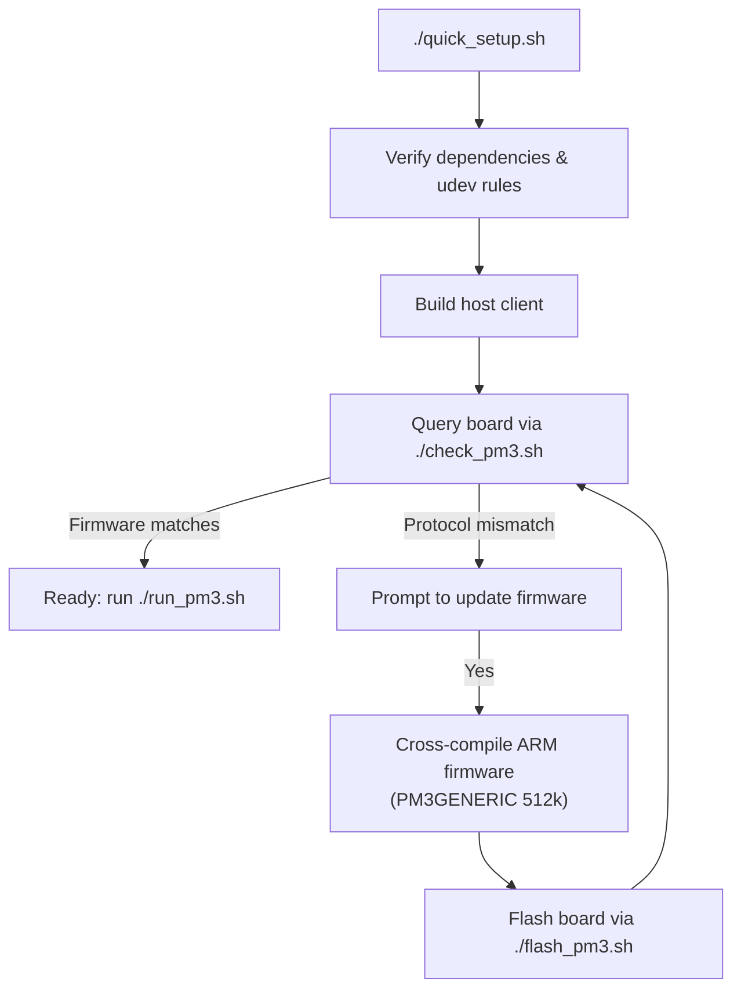

# Proxmark3 Easy (Clone) Setup & Flashing Tools

Scripts to configure, build, and flash Iceman firmware for Proxmark3 Easy clones (`AT91SAM7S512` / `AT91SAM7S256`) on Ubuntu / Debian Linux.

---

## Hardware Background

Proxmark3 clones (typically labeled *Proxmark3 Easy*) differ from the official Proxmark3 RDV4:

* **Platform**: Clones require `PLATFORM=PM3GENERIC`. Compiling with the upstream default (`PM3RDV4`) results in FPGA timing issues and non-functional buttons.
* **Microcontroller**: Most clones use the `AT91SAM7S512` (512 kB flash). Older units may use `AT91SAM7S256` (256 kB flash).
* **Firmware Mismatch**: Clones usually ship with an older factory build of Iceman (`Capabilities v7`). The current client requires `Capabilities v13`.

---

## Quick Start

Run the setup script:

```bash
./quick_setup.sh
```

Execution steps:
1. Checks dependencies and installs `/etc/udev/rules.d/77-pm3-usb-device.rules` (prompts for `sudo` if missing).
2. Clones upstream `RfidResearchGroup/proxmark3` and builds the native client (`client/proxmark3`).
3. Runs a hardware diagnostic on `/dev/proxmark3`.
4. If a protocol mismatch is detected, prompts to cross-compile matching firmware (`PM3GENERIC`) and flash the board.

---

## Workflow Diagram



---

## Script Reference

| Script | Privileges | Purpose |
| :--- | :--- | :--- |
| [`quick_setup.sh`](./quick_setup.sh) | User / Sudo | Automated setup, build, diagnostic, and flashing runner. |
| [`check_pm3.sh`](./check_pm3.sh) | User | Queries port availability, chip architecture, and protocol version. |
| [`run_pm3.sh`](./run_pm3.sh) | User | Launches client with automatic port detection. |
| [`build_pm3.sh`](./build_pm3.sh) | User | Build script (`--client-only`, `--all`, `--256k`). |
| [`flash_pm3.sh`](./flash_pm3.sh) | User | Flashes bootrom and OS image to microcontroller. |
| [`setup_proxmark3_prereqs.sh`](./setup_proxmark3_prereqs.sh) | `sudo` | Installs compiler packages, udev rules, and adds user to `dialout`. |
| [`install_udev.sh`](./install_udev.sh) | `sudo` | Installs udev rules to configure device permissions and ignore ModemManager. |

---

## Recovery / Bootloader Mode

If flashing is interrupted or the device fails to boot:

1. Disconnect the USB cable.
2. Press and hold the physical button on the board.
3. Reconnect the USB cable while holding the button.
4. Keep holding until the two leftmost LEDs stay lit.
5. In your terminal, run:
   ```bash
   cd pm3-source
   ./pm3-flash-bootrom
   ```
6. Release the button, then flash the full image:
   ```bash
   ./pm3-flash-fullimage
   ```
